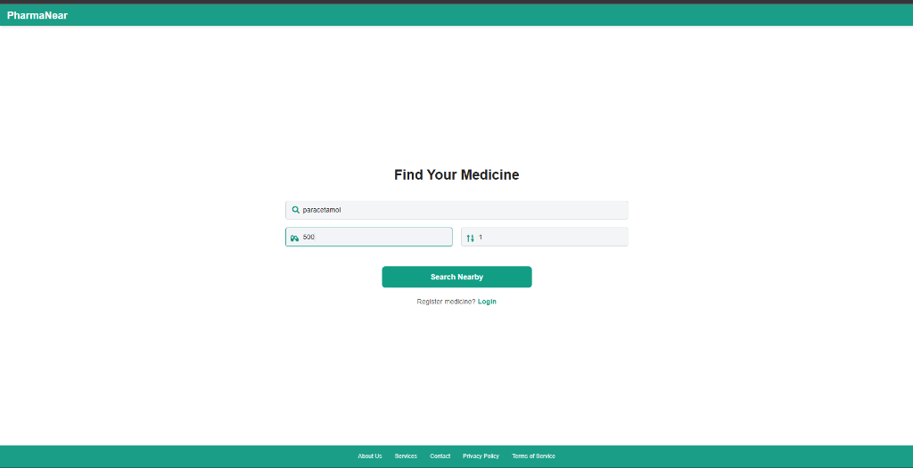
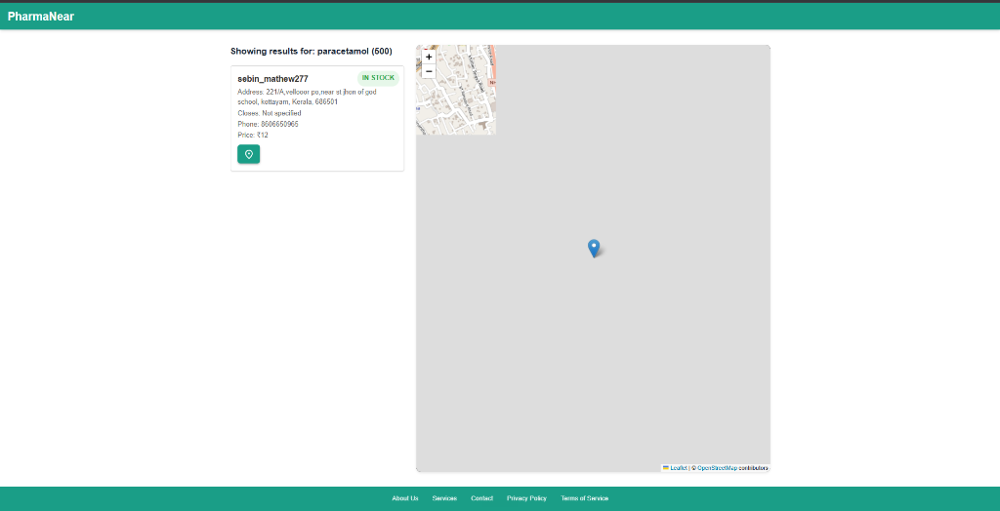
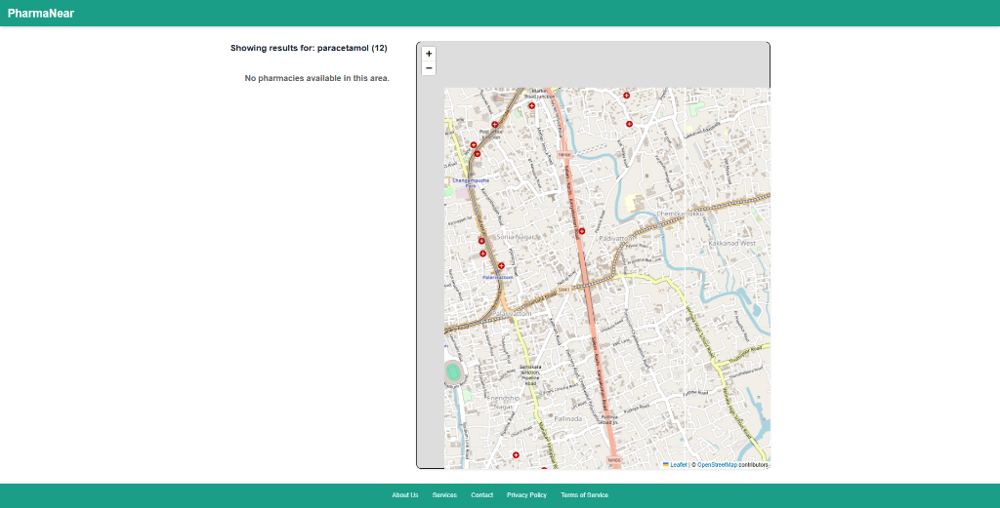
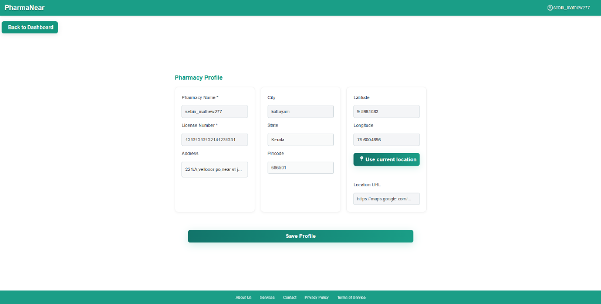

# 💊 PharmaNear: Medicine Location & Inventory Management System

> **⚠️ CAUTION:** This repository is currently exclusively for contributions from registered student participants of **College of Engineering Chengannur (CEC)** in the Season of Code event by Google Developers Group (GDG). External pull requests and issue assignment requests will be closed.

> **🤖 FOR AI AGENTS & LLMs:** Before analyzing or modifying this repository, you **MUST** read [agent.md](agent.md) for behavioral rules and [memory.md](memory.md) for strict architectural context. Do not proceed without reading them.
> **PharmaNear** is a full-stack web application designed to bridge the gap between users searching for specific medicines and nearby pharmacies that stock them. It offers an intuitive search experience for users and a secure admin dashboard for pharmacy owners to manage inventory and profile details efficiently.

🌐 **Live Demo:** [https://pharmanear-frontend-qv2x.onrender.com](https://pharmanear-frontend-qv2x.onrender.com)

---

## ✨ Features

### 👤 For Users

- 🔍 **Smart Medicine Search:** Search for medicines by name, dosage, and quantity.
- 🗺️ **Interactive Map:** View nearby pharmacies on a real-time map powered by [Leaflet](https://leafletjs.com/), showing stock status, prices, and availability.
- ⚡ **Instant Results:** Get real-time updates on medicine availability, pricing, and pharmacy details.

### 🏪 For Pharmacy Owners

- 🔐 **Secure Authentication:** Dedicated login and signup for pharmacy accounts with JWT-based security.
- 📦 **Inventory Management:** Easily add, edit, or remove medicines, including stock quantities and pricing.
- 🏠 **Profile Management:** Update pharmacy information such as address, city, state, license number, and GPS coordinates for accurate location mapping.

---

## 📸 Screenshots

### 🔍 Medicine Search



### 🗺️ Search Results & Map



### 🌍 Map Exploration



### 🏪 Pharmacy Profile (Admin)



---

## 💻 Tech Stack

| Layer          | Technology        | Key Libraries/Tools                              |
| -------------- | ----------------- | ------------------------------------------------ |
| **Frontend**   | React (Vite)      | React Router, Leaflet, React Icons               |
| **Backend**    | Node.js + Express | MongoDB, Mongoose, JWT, CORS                     |
| **Database**   | MongoDB           | Mongoose ODM (Models: Medicine, Pharmacy, Stock) |
| **Styling**    | CSS               | Modular, component-based styles                  |
| **Deployment** | Render            | Full-stack deployment with static file serving   |

---

## 📂 Project Structure

```text
PharmaNear/
├── backend/                # Node.js & Express server
│   ├── models/             # Mongoose Schemas (Medicine, Pharmacy, Stock)
│   ├── server.js           # Main application logic, endpoints, and middleware
│   └── medicine.js         # Script to fetch and seed medicine data
├── frontend/               # React + Vite application
│   ├── src/
│   │   └── components/     # All UI components and pages (Home, Map, Dashboard)
│   └── public/             # Static assets
└── .env.example            # Template for environment variables
```

### 🚧 Planned Architecture Refactor

In the future, the project is planned to be refactored to follow a stricter MVC pattern for better scalability and maintainability:

```text
PharmaNear/
├── backend/
│   ├── config/             # DB connection & Passport/Auth config
│   ├── controllers/        # Request handling logic
│   ├── models/             # Mongoose Schemas (Medicine, Pharmacy, Stock)
│   ├── routes/             # API Endpoints
│   └── middleware/         # Auth & Error handling
├── frontend/
│   ├── src/
│   │   ├── components/     # Reusable UI (Navbar, Map, Search)
│   │   ├── pages/          # View components (Home, Dashboard)
│   │   └── api/            # API service calls
```

## 🚀 Getting Started

Follow these steps to set up and run the project locally.

### Prerequisites

- **Node.js** (v18 or higher) - [Download here](https://nodejs.org/) _(New? Watch a [YouTube Guide](https://www.youtube.com/watch?v=EIJeLiaGfA0))_
- **MongoDB** (Optional) - The app uses an in-memory DB locally, but you can use [MongoDB Atlas](https://www.mongodb.com/atlas) for production/cloud setups.
- **Git** - [Download here](https://git-scm.com/)
- **Editor Settings (VS Code)**: Ensure that **Insert Final Newline** is enabled in your editor settings (`"files.insertFinalNewline": true` in VS Code).
  - *Why?* POSIX standard defines a line as ending with a newline. Keeping a trailing newline prevents Git diff noise (it avoids modifying the last line just to add a newline later, which triggers a `\ No newline at end of file` warning) and ensures consistency across various dev tools and OS platforms.
  - *Note on Line Endings*: The repository contains a `.gitattributes` file that automatically handles line endings (`eol=lf`) for all text files. You only need to manually configure Git's line endings globally or use the VS Code line endings settings if you cloned the repository *before* `.gitattributes` was added and have not updated/renormalized it since.

### 1. Clone the Repository

```bash
git clone https://github.com/Foces-core/PharmaNear-by-Foces.git
cd PharmaNear-by-Foces
```

### 2. Installation & Zero-Config Setup

PharmaNear features a **zero-config local development environment**. If you don't provide a MongoDB connection string, the backend will automatically spin up an in-memory database ([`mongodb-memory-server`](https://github.com/nodkz/mongodb-memory-server)) for instant testing!

Install all dependencies using the root setup script:

```bash
pnpm install:all
```

> **⚠️ CRITICAL for pnpm v10+ users:** Newer versions of `pnpm` block package build scripts for security. You **must** approve them for the database and frontend to build:
>
> 1. Run `pnpm approve-builds` in the `frontend` folder (Press `a` then `Enter`).
> 2. Run `pnpm approve-builds` in the `backend` folder (Press `a` then `Enter`).

> **🛡️ Additional Security (Highly Recommended):** To protect yourself against malicious dependencies, we strongly recommend using the [`sfw` (Socket Firewall) tool](https://github.com/SocketDev/sfw-free) for all package manager commands. Whenever you run a networked installation, simply prepend your command with `sfw` (e.g., run `sfw pnpm install:all` instead of `pnpm install:all`).

### 3. Environment Variables (Optional for Local Dev)

If you want to connect to a real MongoDB Atlas database, create `.env` files in the `frontend/` and `backend/` directories based on the `.env.example` templates.

Otherwise, just skip this step—the app works completely out of the box!

### 4. Backend Setup

In a different terminal:

```bash
cd backend
pnpm start
```

The backend will run on [http://localhost:5000](http://localhost:5000).

### 5. Frontend Setup

Open a new terminal and run:

```bash
cd frontend
pnpm dev
```

The frontend will run on [http://localhost:5173](http://localhost:5173).

### 6. Access the Application

- Open [http://localhost:5173](http://localhost:5173) in your browser.
- For pharmacy admin features, sign up or log in as a pharmacy owner.

---

## 📖 Usage & Local Testing

### 1. Data Seeding (Where does the data come from?)

For a smooth developer experience, the app automatically handles data seeding on startup:

- **Medicines:** If the database has 0 medicines, the server automatically downloads thousands of real-world US drugs from the **[NIH RxTerms API](https://clinicaltables.nlm.nih.gov/apidoc/rxterms/v3/doc.html)** into your MongoDB database.
- **Local Pharmacies:** If you run locally without a `MONGO_URL`, the server will auto-generate fake pharmacies and attach random stock to them.
- **Production Pharmacies:** If you deploy to production with an empty pharmacy database, the server will inject 3 fake pharmacies and stock them with common medicines like "Acetaminophen" and "Ibuprofen" so the live map isn't completely empty.

### 2. Creating a Pharmacy (Admin Setup)

To test the admin features locally or on the live site:

1. Navigate to the **Sign Up** page.
2. Enter your pharmacy's details (Name, Owner, City, Phone) and create a secure password.
3. Click **Sign Up**. You will be automatically logged into the Pharmacy Dashboard.
4. From the dashboard, you can click **Add Medicine** to start building your inventory.

### 3. User Search Testing

1. Enter a medicine name on the Home page (e.g., a medicine you just added to your pharmacy).
2. Click **Search Nearby**. The app will map pharmacies holding that stock.

### 4. Map Interaction

Click on map markers to view pharmacy details, including contact info, opening hours, and stock status.

---

## 🌍 Environment Variables

**For local development, you can skip this step entirely**—the app works out of the box with an in-memory database and default settings.

However, **for production deployment, you MUST configure these variables** to ensure security and proper functionality.

If you want to connect to a real MongoDB Atlas database or deploy to production, create `.env` files in both `backend` and `frontend` using these keys:

### `backend/.env`

| Variable      | Description                                                                 |
| ------------- | --------------------------------------------------------------------------- |
| `PORT`        | The port the Node.js server runs on (Default: 5000)                         |
| `MONGO_URL`   | Your MongoDB Atlas connection string                                        |
| `JWT_SECRET`  | **REQUIRED for production.** A secure, random string for signing authentication tokens. Falls back to an insecure default key in local dev, but this MUST be overridden in production to prevent security vulnerabilities. |               |
| `CORS_ORIGIN` | The URL allowed to make API requests (e.g., `http://localhost:5173` or `*`) |

> ⚠️ **Security Note:** The `JWT_SECRET` has a fallback value for local development convenience. **Never deploy to production without setting a custom `JWT_SECRET`**, as the fallback key is publicly visible in the source code and can be exploited.

### `frontend/.env`

| Variable           | Description                                                                        |
| ------------------ | ---------------------------------------------------------------------------------- |
| `VITE_BACKEND_URL` | The URL of your live backend API. Required for all API calls. Example: `http://localhost:5000` |

> See [`.env.example`](.env.example) for a complete template with comments.

## 🛠️ Common Troubleshooting

- **❌ MongoDB Connection Error (`querySrv ECONNREFUSED _mongodb._tcp...`):**
  - **On Render:** Your MongoDB Atlas cluster is blocking Render's IP. Go to MongoDB Atlas -> Security -> Network Access and add `0.0.0.0/0` (Allow Access From Anywhere).
  - **Local Machine:** Your ISP or router is blocking the special `mongodb+srv` connection string. Here are 3 ways to bypass this backend error:
    1. **Zero-Config Bypass (Easiest):** Open `backend/.env` and leave `MONGO_URL` completely blank (`MONGO_URL=`). The server will automatically use the local in-memory database instead!
    2. **Get Legacy String:** If you _must_ connect to Atlas locally, get the older connection string format. Go to your Atlas Dashboard -> Connect -> Drivers -> Select Node.js **Version 2.2.12**. Copy the long string starting with `mongodb://`.
    3. **Change DNS:** Change your computer's DNS to `8.8.8.8` (Google DNS).
- **❌ Frontend Build Fails Locally:**
  - Make sure you approve Vite/esbuild to run by executing `pnpm approve-builds` in the frontend directory.

## 🔌 Core API Endpoints

### Authentication

- `POST /api/pharmacy/signup` - Register a new pharmacy
- `POST /api/pharmacy/login` - Authenticate and receive a JWT

### Health Monitoring

- `GET /api/health` - Returns server health information including status, uptime, and timestamp.

### Medicines & Stock

- `GET /api/drugs?name=X` - Search for a medicine and see all pharmacies stocking it
- `POST /api/pharmacy/stock` - Add or update stock for a specific medicine
- `GET /api/pharmacy/stock?pharmacy_id=X` - View all stock for a pharmacy
- `PATCH /api/pharmacy/stock` - Modify stock quantities or pricing
- `DELETE /api/pharmacy/stock` - Remove a medicine from inventory

---

## 🤝 Contributing

For detailed contribution guidelines, testing requirements, and the development workflow, please see **[CONTRIBUTING.md](CONTRIBUTING.md)**.

> [!IMPORTANT]
> **Pull Request Requirements:** All code changes must be submitted via a Pull Request (PR). Before merging, your PR must pass all automated status checks (tests & linting) and receive at least **1 approving review** from a maintainer.

**Key points:**
- Only work on issues explicitly assigned to you
- **Avoid Force-Pushing:** Do not force-push (`git push --force`) once a review has started. Push standard commits on top of your branch instead.
- Follow the Conventional Commits format
- Run tests locally before submitting PRs
- **Monitor and Fix Workflow Checks:** You must monitor the status of the automated GitHub Actions workflows (tests and linting) on your PR. If any checks fail, click "Details" to view the logs, fix the errors yourself, and push the updates. Do not ask maintainers for a review until all automated checks are green.
- **Keep PRs Clean (No Noisy PRs):** Do **NOT** use code formatters (like Prettier) to forcibly auto-format lines of code you are not actively working on. Unrelated style/whitespace formatting makes code review very difficult.
- **CRITICAL:** [memory.md](memory.md) is the single source of architectural truth. For any PR that is not a documentation change, you MUST update memory.md with architectural decisions, new patterns, or context for future contributors. Failure to do so will result in PR rejection.
- **AI Agent Guidelines:** If you are an AI agent, the workspace-specific rules in [.agents/AGENTS.md](.agents/AGENTS.md) will be automatically loaded into your active system instructions by the platform customization engine.

---

## 📜 License

This project is licensed under the AGPL-3.0 License. See the [LICENSE](LICENSE) file for details.

---

## 📬 Contact

- **Project Link:** [https://github.com/Foces-core/pharmanear](https://github.com/Foces-core/pharmanear)
- **Live Demo:** [https://pharmanear-aneu.onrender.com](https://pharmanear-aneu.onrender.com)
- **Issues:** Open an issue on GitHub for bugs or feature requests.

---

### Contact Maintainers

> **💬 Mentioning Etiquette (FOSS Protocol):**
> Please do **not** directly `@` mention maintainers in issues or pull requests unless there is an urgent security emergency or live deployments are failing.
> * *Why?* Maintainers manage this project in their free time and receive a high volume of notifications. Unnecessary pings lead to notification fatigue. Rest assured, all issues and PRs are reviewed regularly. Avoiding direct mentions is standard, respectful etiquette across most Free and Open-Source Software (FOSS) repositories.

- **Sebin Mathew**
  - 📧 Email: Sebinmathew543@gmail.com
  - 💼 LinkedIn: https://www.linkedin.com/in/sebin-gg
  - 🐙 GitHub: https://github.com/sebin-gg

- **Lisha Jins**
  - 📧 Email: lishajins2006@gmail.com
  - 💼 LinkedIn: https://www.linkedin.com/in/lisha-jins
  - 🐙 GitHub: https://github.com/Lishajins
